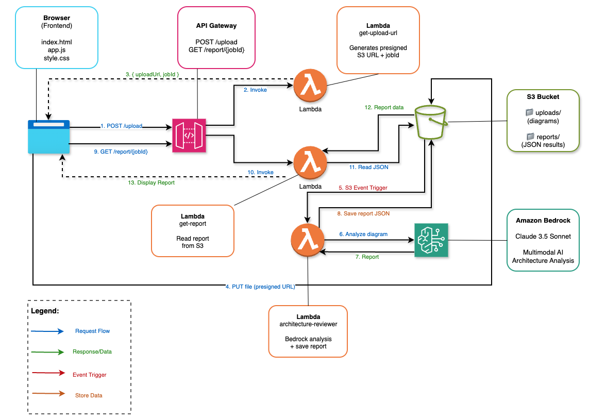

# 🏗️ AI Architecture Reviewer

> Upload an AWS architecture diagram → get an instant AI-powered **Well-Architected Framework** review powered by **Amazon Bedrock (Claude 3.5 Sonnet)**.



---

## Prerequisites

| Tool | Version |
|------|---------|
| [Terraform](https://developer.hashicorp.com/terraform/downloads) | ≥ 1.5 |
| [AWS CLI](https://aws.amazon.com/cli/) | ≥ 2.x, configured |
| AWS credentials | `AdministratorAccess` or scoped IAM |

> [!IMPORTANT]
> **Before deploying**, enable Bedrock model access in the AWS Console:
> **Bedrock → Model access → Enable `Claude 3.5 Sonnet`** (in `us-east-1`)

---

## Deploy in 2 commands

```bash
# 1. Full deploy (Terraform apply + auto-configure frontend)
make deploy

# 2. Open the UI
open frontend/index.html
```

---

## Step-by-step

```bash
# Init Terraform
make init

# Preview what will be created
make plan

# Deploy infrastructure
make apply

# Inject the API Gateway URL into frontend/app.js
make configure-frontend

# Open in browser
open frontend/index.html
```

---

## Usage

1. Open `frontend/index.html` in your browser
2. Drag & drop (or browse) your architecture diagram
   - Supported: **PNG, JPG, PDF, draw.io XML**
3. Wait ~15–30 seconds for Claude to analyze
4. Review the report:
   - **⚠️ Detected Issues** — severity-tagged, pillar-mapped
   - **💡 Recommendations** — actionable, with AWS service tags
   - **🏗️ Well-Architected Risks** — per-pillar risk level
   - **📊 Pillar Scores** — 1–5 score for all 6 WAF pillars

---

## Tear down

```bash
make destroy
```

---

## Project Structure

```
03. Architecture review/
├── terraform/
│   ├── main.tf            # Providers, locals
│   ├── variables.tf       # All config variables
│   ├── s3.tf              # S3 bucket, CORS, lifecycle, notifications
│   ├── iam.tf             # Lambda execution role + policies
│   ├── lambda.tf          # 3 Lambda functions
│   ├── api_gateway.tf     # REST API + CORS
│   └── outputs.tf         # API URL, bucket, function name
├── src/
│   ├── get_upload_url/    # Lambda: generate presigned S3 URL
│   ├── reviewer/          # Lambda: Bedrock Claude analysis
│   └── get_report/        # Lambda: read report from S3
├── frontend/
│   ├── index.html         # Upload UI + report display
│   ├── style.css          # Dark mode design
│   └── app.js             # Upload flow + polling + rendering
├── Makefile               # deploy / destroy / logs shortcuts
└── README.md
```

---

## Cost estimate

| Service | Cost |
|---------|------|
| Claude 3.5 Sonnet | ~$0.003–0.01 per analysis |
| Lambda | Free tier covers ~1M requests/month |
| S3 | < $0.01/month at low volume |
| API Gateway | < $0.01/month at low volume |
